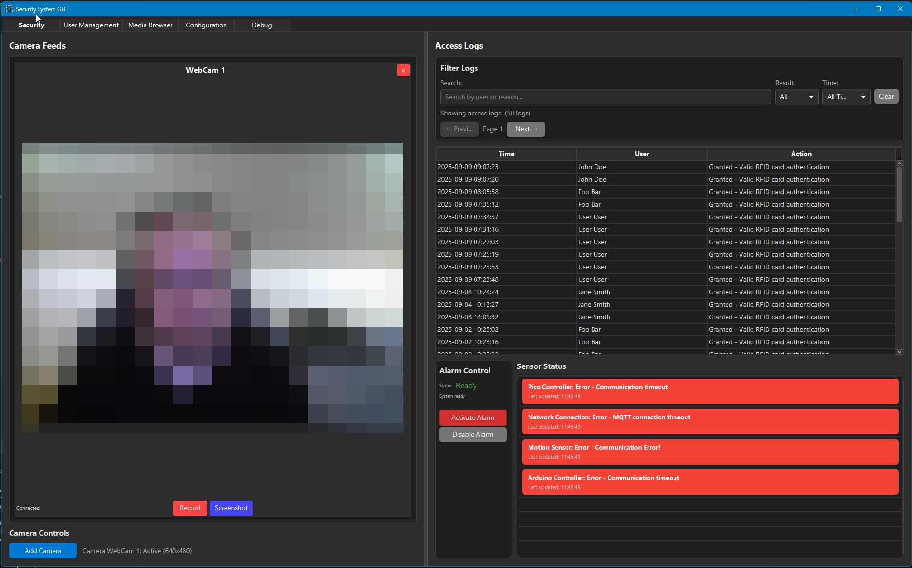
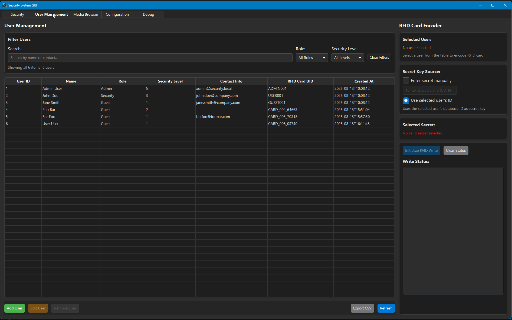
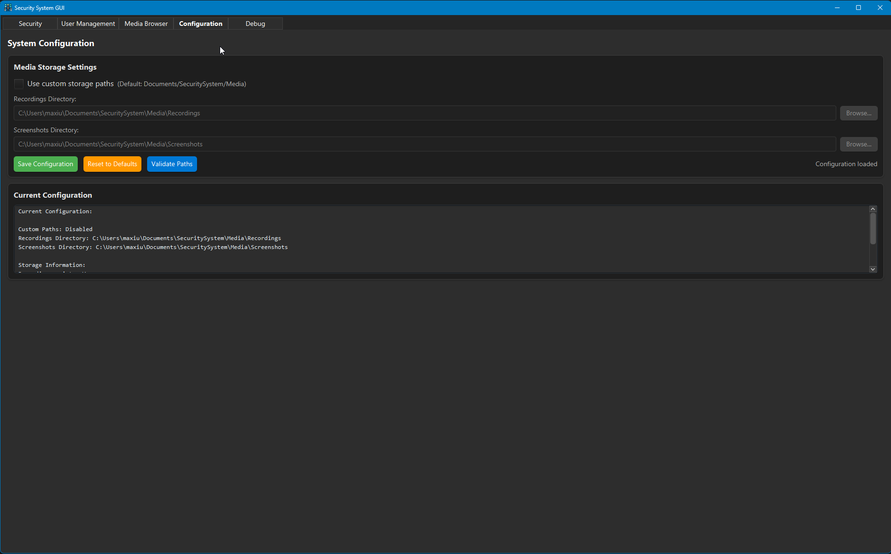
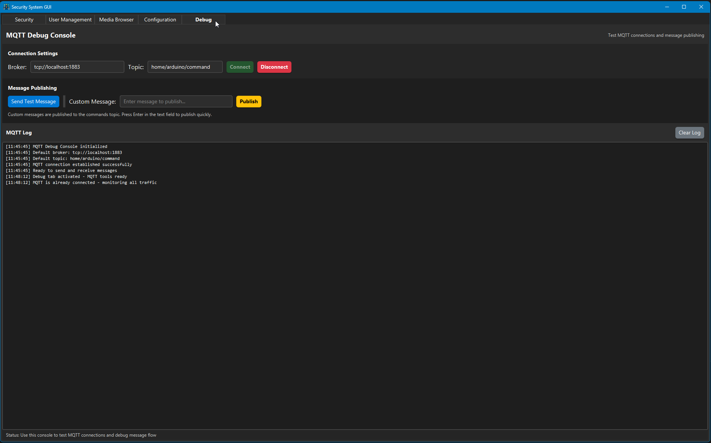

# Security System Project

A comprehensive IoT security system built with Arduino Uno R3, Raspberry Pi Pico W, and a JavaFX client application. The system provides motion detection, RFID authentication, and real-time monitoring capabilities through MQTT communication.

## 🌟 Features

- **Motion Detection**: PIR sensor-based motion detection with customizable grace periods
- **RFID Authentication**: Secure access control using MIFARE Classic cards
- **Real-time Monitoring**: Live status updates and alerts through MQTT
- **User Management**: Add, remove, and manage user access cards
- **Remote Control**: Control system states remotely via the desktop application
- **Visual Feedback**: RGB LED indicators for system status
- **Audio Alerts**: Buzzer for alarm notifications
- **Multi-platform**: Desktop client built with JavaFX

## 📱 Client Application Examples

### Main Dashboard

*The main dashboard showing system status, recent events, and quick controls*

### Security Tab

*Security monitoring tab with live sensor data and alarm controls*

### User Management

*User management interface for adding/removing RFID cards and managing permissions*

### Configuration Settings

*System configuration panel for MQTT and database settings*

### Debug Console

*Real-time debug console showing system communications and events*

## 🔧 Hardware Requirements

### Arduino Uno R3 Components
- Arduino Uno R3 board
- MFRC522 RFID module
- PIR motion sensor
- RGB LED (common cathode)
- Active buzzer
- Push button
- Resistors (220Ω for LEDs, 10kΩ for button pull-up)
- Jumper wires and breadboard

### Raspberry Pi Pico W
- Raspberry Pi Pico W board
- Micro USB cable for programming

### Additional Requirements
- Computer running Windows/Linux/macOS for the client application
- WiFi network
- MQTT broker (Mosquitto)
- MySQL database

## 🔌 Hardware Setup

### Arduino Uno R3 Pin Configuration

| Component | Arduino Pin | Notes |
|-----------|-------------|-------|
| RFID MFRC522 SDA/SS | 10 | |
| RFID MFRC522 SCK | 13 | SPI Clock |
| RFID MFRC522 MOSI | 11 | SPI Data Out |
| RFID MFRC522 MISO | 12 | SPI Data In |
| RFID MFRC522 RST | 9 | Reset Pin |
| RFID MFRC522 3.3V | 3.3V | Power |
| RFID MFRC522 GND | GND | Ground |
| RGB LED Red | 3 | PWM Pin |
| RGB LED Green | 6 | PWM Pin |
| RGB LED Blue | 5 | PWM Pin |
| RGB LED Common | GND | Common Cathode |
| PIR Motion Sensor | 7 | Digital Input |
| Buzzer | 8 | Digital Output |
| Rearm Button | 2 | Digital Input (Pull-up) |
| Pico UART TX | A1 | Communication with Pico |
| Pico UART RX | A0 | Communication with Pico |

### Raspberry Pi Pico W Pin Configuration

| Function | Pico Pin | Notes |
|----------|----------|-------|
| UART0 TX | GP0 | Communication with Arduino |
| UART0 RX | GP1 | Communication with Arduino |

### Circuit Diagram

*Complete wiring diagram showing connections between Arduino, Pico W, and components*

### Physical Setup

*Example of the complete hardware setup on breadboard*

## 🌐 MQTT Server Setup (Mosquitto)

### Windows Installation

1. **Download Mosquitto**
   ```bash
   # Visit https://mosquitto.org/download/ and download the Windows installer
   # Or use chocolatey:
   choco install mosquitto
   ```

2. **Configure Mosquitto**
   
   Create or edit `mosquitto.conf`:
   ```conf
   # mosquitto.conf
   listener 1883
   allow_anonymous true
   log_dest file C:\mosquitto\log\mosquitto.log
   log_type error
   log_type warning
   log_type notice
   log_type information
   ```

3. **Start Mosquitto Service**
   ```bash
   # Start as Windows service
   net start mosquitto
   
   # Or run manually
   mosquitto -c mosquitto.conf -v
   ```

### Linux Installation

1. **Install Mosquitto**
   ```bash
   # Ubuntu/Debian
   sudo apt update
   sudo apt install mosquitto mosquitto-clients
   
   # CentOS/RHEL
   sudo yum install mosquitto mosquitto-clients
   ```

2. **Configure and Start**
   ```bash
   # Start and enable service
   sudo systemctl start mosquitto
   sudo systemctl enable mosquitto
   
   # Check status
   sudo systemctl status mosquitto
   ```

### Testing MQTT Connection
```bash
# Subscribe to test topic
mosquitto_sub -h localhost -t test/topic

# Publish test message (in another terminal)
mosquitto_pub -h localhost -t test/topic -m "Hello MQTT"
```

## 🤖 Arduino Project Setup

### Prerequisites
- Arduino IDE or VS Code with PlatformIO extension
- Arduino Uno R3 drivers installed

### Using Arduino IDE

1. **Install Required Libraries**
   - Open Arduino IDE
   - Go to `Tools > Manage Libraries`
   - Install the following libraries:
     - `MFRC522` by GithubCommunity
     - `SoftwareSerial` (usually included)

2. **Upload Code**
   - Open `Arduino/src/main.cpp`
   - Select `Tools > Board > Arduino Uno`
   - Select the correct COM port in `Tools > Port`
   - Click `Upload` or press `Ctrl+U`

### Using VS Code with PlatformIO

1. **Install PlatformIO Extension**
   - Open VS Code
   - Install the PlatformIO IDE extension

2. **Open Project**
   - Open the `Arduino` folder in VS Code
   - PlatformIO will automatically detect the project

3. **Build and Upload**
   ```bash
   # Build the project
   pio run
   
   # Upload to Arduino
   pio run --target upload
   
   # Monitor serial output
   pio device monitor
   ```

### Verification
- Open Serial Monitor (9600 baud)
- You should see initialization messages
- LED should briefly flash during startup

## 🥧 Raspberry Pi Pico W Setup

### Prerequisites
- Thonny IDE or VS Code with MicroPython extension
- MicroPython firmware on Pico W

### Install MicroPython on Pico W

1. **Download MicroPython Firmware**
   - Visit [MicroPython downloads](https://micropython.org/download/rp2-pico-w/)
   - Download the latest `.uf2` file

2. **Flash Firmware**
   - Hold BOOTSEL button while connecting Pico W to computer
   - Drag and drop the `.uf2` file to the RPI-RP2 drive
   - Pico W will reboot automatically

### Configure WiFi and MQTT Settings

1. **Edit Configuration**
   
   Open `Pico/main.py` and update the following variables:
   ```python
   # WiFi credentials
   ssid = 'YOUR_WIFI_NETWORK_NAME'
   password = 'YOUR_WIFI_PASSWORD'
   
   # MQTT Broker IP (your computer's IP address)
   mqtt_server = '192.168.1.100'  # Replace with your PC's IP
   mqtt_port = 1883
   ```

2. **Find Your Computer's IP Address**
   ```bash
   # Windows
   ipconfig
   
   # Linux/macOS
   ifconfig
   ```

### Upload and Run

#### Using Thonny

1. **Install Thonny**
   - Download from [thonny.org](https://thonny.org/)

2. **Connect to Pico W**
   - Open Thonny
   - Go to `Tools > Options > Interpreter`
   - Select "MicroPython (Raspberry Pi Pico)"
   - Select the correct COM port

3. **Upload Code**
   - Open `Pico/main.py`
   - Click `Run > Run current script`
   - Or save as `main.py` on the Pico for auto-start

#### Using VS Code

1. **Install MicroPython Extension**
   - Install "MicroPython" extension by paulober

2. **Configure Project**
   - Open Command Palette (`Ctrl+Shift+P`)
   - Run "MicroPython: Configure project"
   - Select your Pico W device

3. **Upload and Run**
   - Right-click `main.py`
   - Select "Upload file to Pico"
   - Open terminal and connect to see output

### Verification
- Pico W should connect to WiFi
- MQTT connection should be established
- You should see heartbeat messages in the terminal

## 💻 Client Application Setup

### Prerequisites
- Java 11 or higher
- Maven (included via wrapper)
- MySQL database
- Running MQTT broker

### Database Setup

1. **Install MySQL**
   - Download and install MySQL Community Server
   - Note the root password during installation

2. **Create Database**
   ```sql
   CREATE DATABASE security_system;
   CREATE USER 'secuser'@'localhost' IDENTIFIED BY 'secpass123';
   GRANT ALL PRIVILEGES ON security_system.* TO 'secuser'@'localhost';
   FLUSH PRIVILEGES;
   ```

3. **Import Schema**
   ```bash
   mysql -u secuser -p security_system < SecuritySystemClient/schema.sql
   ```

### Build and Run Applications

1. **Open Project in VS Code**
   ```bash
   cd SecuritySystemClient
   code .
   ```

2. **Build Projects**
   ```bash
   # Clean and build all modules
   ./mvnw.cmd clean package
   
   # On Linux/macOS use:
   ./mvnw clean package
   ```

3. **Run Auth Server (First Time)**
   ```bash
   java -jar auth-server/target/auth-server-1.0-SNAPSHOT-fat.jar
   ```
   
   This creates configuration files in `Documents/SecuritySystem/auth-server.properties`

4. **Configure Auth Server**
   
   Edit `Documents/SecuritySystem/auth-server.properties`:
   ```properties
   # Database Configuration
   db.url=jdbc:mysql://localhost:3306/security_system
   db.username=secuser
   db.password=secpass123
   
   # MQTT Configuration
   mqtt.broker.url=tcp://localhost:1883
   mqtt.client.id=auth-server
   mqtt.topic.auth.request=home/arduino/auth_requests
   mqtt.topic.auth.response=home/arduino/auth_response
   
   # Server Configuration
   server.port=8080
   ```

5. **Run Client Application (First Time)**
   ```bash
   java -jar client/target/client-1.0-SNAPSHOT-fat.jar
   ```
   
   This creates configuration files in `Documents/SecuritySystem/client.properties`

6. **Configure Client Application**
   
   Edit `Documents/SecuritySystem/client.properties`:
   ```properties
   # Database Configuration
   db.url=jdbc:mysql://localhost:3306/security_system
   db.username=secuser
   db.password=secpass123
   
   # MQTT Configuration
   mqtt.broker.url=tcp://localhost:1883
   mqtt.client.id=security-client
   mqtt.topic.events=home/arduino/events
   mqtt.topic.commands=home/arduino/command
   
   # Auth Server Configuration
   auth.server.url=http://localhost:8080
   ```

### Running the Complete System

1. **Start Services in Order**
   ```bash
   # 1. Start MQTT Broker
   mosquitto -c mosquitto.conf -v
   
   # 2. Start Auth Server
   java -jar auth-server/target/auth-server-1.0-SNAPSHOT-fat.jar
   
   # 3. Start Client Application
   java -jar client/target/client-1.0-SNAPSHOT-fat.jar
   ```

2. **Verify System Status**
   - Client application should show "Connected" status
   - Arduino and Pico W should show heartbeat messages
   - Motion sensor should trigger events in the client

### Application Screenshots

#### First Run Setup

*Configuration wizard that appears on first run*

#### System Status Connected

*Dashboard showing all components connected and operational*

## 🚀 Usage Guide

### Initial Setup

1. **Add RFID Cards**
   - Navigate to User Management tab
   - Click "Add New User"
   - Follow the wizard to register new RFID cards

2. **Test Motion Detection**
   - Ensure system is in "READY" state
   - Wave hand in front of PIR sensor
   - Observe LED color changes and client notifications

3. **Test RFID Authentication**
   - Place registered RFID card near reader
   - System should authenticate and change status

### System States

| State | LED Color | Description |
|-------|-----------|-------------|
| READY | OFF | System armed and monitoring |
| MOTION_DETECTED | ORANGE | Motion detected, grace period active |
| ALARM_ACTIVE | RED | Alarm triggered, buzzer active |
| ALARM_DISABLED | GREEN | System disarmed |
| RFID_WRITE_MODE | BLUE | Programming new RFID card |

### Common Operations

- **Disable Alarm**: Use RFID card or client application
- **Reset Alarm**: Press rearm button or use client
- **Add User**: Use client application RFID write feature
- **Monitor System**: View real-time status in client dashboard

## 🛠️ Troubleshooting

### Arduino Issues
- **No serial output**: Check baud rate (9600)
- **RFID not working**: Verify SPI connections
- **LED not changing**: Check PWM pin connections

### Pico W Issues
- **WiFi connection failed**: Verify credentials and signal strength
- **MQTT connection failed**: Check broker IP and port
- **Communication errors**: Verify UART connections to Arduino

### Client Application Issues
- **Database connection failed**: Check MySQL service and credentials
- **MQTT connection failed**: Verify broker is running and accessible
- **Auth server connection failed**: Ensure auth server is running on correct port

### Network Issues
- **Components not communicating**: Check firewall settings
- **MQTT messages not received**: Verify topic names match
- **IP address changes**: Update configuration files with new IPs

## 📁 Project Structure

```
SecuritySystem/
├── Arduino/                 # Arduino Uno R3 project
│   ├── src/
│   │   └── main.cpp        # Main Arduino code
│   ├── platformio.ini      # PlatformIO configuration
│   └── ...
├── Pico/                   # Raspberry Pi Pico W project
│   └── main.py             # Main Pico code
├── SecuritySystemClient/   # Java applications
│   ├── auth-server/        # Authentication server
│   ├── client/             # JavaFX client application
│   ├── schema.sql          # Database schema
│   └── pom.xml             # Maven configuration
└── docs/                   # Documentation and images
    └── images/
```

## 🔒 Security Considerations

- **RFID Security**: Uses MIFARE Classic with default keys (suitable for demonstration)
- **Network Security**: MQTT runs without authentication (configure for production use)
- **Database Security**: Use strong passwords and proper user permissions
- **Physical Security**: Secure hardware connections and enclosure

## 📄 License

This project is for educational purposes. Please check individual component licenses for commercial use.

## 🤝 Contributing

1. Fork the repository
2. Create a feature branch
3. Make your changes
4. Test thoroughly
5. Submit a pull request

## 📞 Support

For issues and questions:
1. Check the troubleshooting section
2. Review hardware connections
3. Verify configuration files
4. Check system logs and serial output

## 🔄 Version History

- **v1.0**: Initial release with basic functionality
- **v1.1**: Added user management and RFID writing
- **v1.2**: Improved MQTT reliability and error handling
- **v1.3**: Enhanced client UI and configuration management